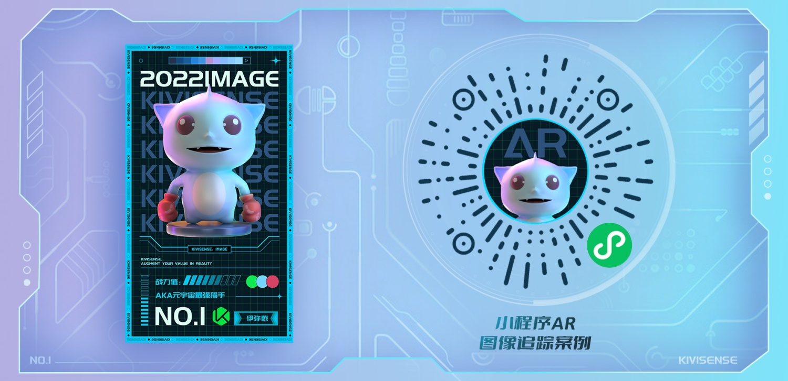

# kivicube-scene 组件 AR 图像跟踪小程序示例

> 描述：此项目是基于 **[kivicubeAR 插件](https://mp.weixin.qq.com/wxopen/plugindevdoc?appid=wx3bbab3920eabccb2&token=&lang=zh_CN)** 开发的示例小程序。给开发者提供了一个比较完整的示例和流程。

## 目录说明

<pre>
.
|
├── assets                        // 一些素材资源
|
├── components                    // 一些UI组件
│
├── pages                         // 页面
│    ├── index                    // 首页
│    ├── photo                    // 拍照页面
│    ├── scene                    // kivicube-scene场景页面
│
├── utils                         // 一些工具方法
</pre>

---

## 体验小程序

- 微信小程序搜索 “AR 图像跟踪” 或扫描下方图片右侧的二维码打开示例小程序。

- 进入小程序的扫描界面后，扫描图片左侧识别图进行体验。
